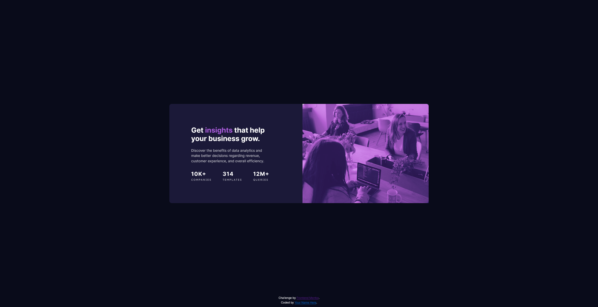
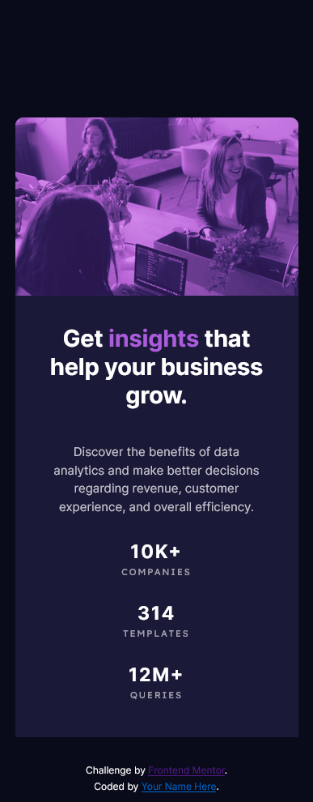

# Frontend Mentor - Stats preview card component solution

This is a solution to the [Stats preview card component challenge on Frontend Mentor](https://www.frontendmentor.io/challenges/stats-preview-card-component-8JqbgoU62). Frontend Mentor challenges help you improve your coding skills by building realistic projects. 

## Table of contents

- [Overview](#overview)
  - [The challenge](#the-challenge)
  - [Screenshot](#screenshot)
  - [Links](#links)
- [My process](#my-process)
  - [Built with](#built-with)
  - [What I learned](#what-i-learned)
  - [Continued development](#continued-development)
  - [Useful resources](#useful-resources)
- [Author](#author)


**Note: Delete this note and update the table of contents based on what sections you keep.**

## Overview

### The challenge

Users should be able to:

- View the optimal layout depending on their device's screen size

### Screenshot





### Links

- Solution URL: [Add solution URL here](https://your-solution-url.com)
- Live Site URL: [Add live site URL here](https://your-live-site-url.com)

## My process

### Built with

- Semantic HTML5 markup
- CSS custom properties
- Flexbox

### What I learned

learned a lot of things about flexbox columns and rows still a bit of learning to do in that area
but i liked how easy it was when i wanted to change from desktop to mobile all i had to do for the main style is to change from a row to colum in flex direction

```
body {
    flex-direction: column;
  }
```


### Continued development

i want to try more projects with flexbox to practice a bit more

### Useful resources

- [santu369 on the project](https://github.com/santu369/frontendmentor-stats-preview-card-component) - i know its kinda cheating but i wanted to understand a bit more and this was helpful didn't copy anything though just tried to understand how he proceeded with the project to understand.

## Author


- Frontend Mentor - [@nas22663](https://www.frontendmentor.io/profile/nas22663)

